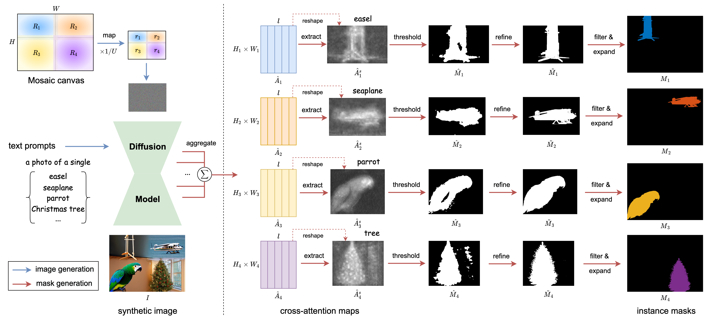

<div align="center">

<h1>MosaicFusion: Diffusion Models as Data Augmenters for Large Vocabulary Instance Segmentation</h1>

<div>
    <a href='https://jiahao000.github.io/' target='_blank'>Jiahao Xie</a><sup>1</sup>&emsp;
    <a href='https://weivision.github.io/' target='_blank'>Wei Li</a><sup>1</sup>&emsp;
    <a href='https://lxtgh.github.io/' target='_blank'>Xiangtai Li</a><sup>1</sup>&emsp;
    <a href='https://liuziwei7.github.io/' target='_blank'>Ziwei Liu</a><sup>1</sup>&emsp;
    <a href='https://personal.ntu.edu.sg/asysong/' target='_blank'>Yew Soon Ong</a><sup>2</sup>&emsp;
    <a href='https://www.mmlab-ntu.com/person/ccloy/' target='_blank'>Chen Change Loy</a><sup>1</sup>
</div>
<div>
    <sup>1</sup>S-Lab, <sup>2</sup>Nanyang Technological University
</div>

<div>
    <h4 align="center">
        • <a href="https://arxiv.org/abs/2309.13042" target='_blank'>[arXiv]</a> •
    </h4>
</div>

<strong>We present MosaicFusion, a general diffusion-based data augmentation pipeline for large-vocabulary instance segmentation. The MosaicFusion-synthesized instance segmentation dataset can be used to train various downstream detection and segmentation models to improve their performances, especially for rare and novel categories.</strong>

<div style="text-align:center">

</div>

🤩 <ins>Key Properties</ins>

<html>
    <table style="margin-left: auto; margin-right: auto;">
        <tr>
            <td>
                <li>Training-free</li> 
                <li>Directly generate multiple objects</li>
                <li>Agnostic to detection architectures</li>
                <li>Without extra detectors or segmentors</li>
            </td>
        </tr>
    </table>
</html>

---

</div>

## 😎 Method

MosaicFusion is a <i>training-free</i> diffusion-based dataset augmentation pipeline that can produce image and mask pairs with multiple objects simultaneously using the off-the-shelf text-to-image diffusion models. The overall pipeline of MosaicFusion consists of two components: image generation and mask generation.

<div style="text-align:center">

</div>

## 🥰 Qualitative Examples

Given only interest category names, MosaicFusion can generate high-quality multi-object images and masks simultaneously by conditioning on a specific text prompt for each region.

<div style="text-align:center">

</div>

## 🛠️ Usage

### Installation

- Clone our [repo](https://github.com/Jiahao000/MosaicFusion) from GitHub:
```shell
git clone https://github.com/Jiahao000/MosaicFusion.git
cd MosaicFusion
```
- Create the `conda` environment:
```shell
conda env create -f environment.yml
```
- Download [lvis_v1_train.json](https://dl.fbaipublicfiles.com/LVIS/lvis_v1_train.json.zip), unzip and put it under a directory, e.g., `data/lvis/meta/lvis_v1_train.json`.

### Data Generation

1. Generate images and masks with MosaicFusion:
```shell
bash scripts/dist_text2seg.sh "a photo of a single category" output/text2seg Generation_log
```
Alternatively, if you run `MosaicFusion` on a cluster managed with [slurm](https://slurm.schedmd.com/):
```shell
bash scripts/slurm_text2seg.sh Dummy Generation_job "a photo of a single category" output/text2seg Generation_log
```
2. Convert generated images and masks to the required data format:
```shell
bash scripts/run_seg2ann.sh output/text2seg output/seg2ann
```
3. Merge MosaicFusion annotations into LVIS annotations:
```shell
bash scripts/run_merge_ann.sh data/lvis/meta/lvis_v1_train.json output/seg2ann/annotations/lvis_v1_train_mosaicfusion.json output/seg2ann/annotations/lvis_v1_train_merged.json
```

### Training Downstream Detectors or Segmentors

Please refer to [TRAIN.md](TRAIN.md) for training details.

## 👨‍💻 Todo
- [x] Data generation code for MosaicFusion
- [ ] Third-party training code with MosaicFusion data

## 🤟 Citation
If you find this work useful for your research, please consider citing our paper:
```bibtex
@article{xie2023mosaicfusion,
  author = {Xie, Jiahao and Li, Wei and Li, Xiangtai and Liu, Ziwei and Ong, Yew Soon and Loy, Chen Change},
  title = {MosaicFusion: Diffusion Models as Data Augmenters for Large Vocabulary Instance Segmentation},
  journal = {arXiv preprint arXiv:2309.13042},
  year = {2023}
}
```

## 🗞️ License

Distributed under the S-Lab License. See [LICENSE](./LICENSE) for more information.
